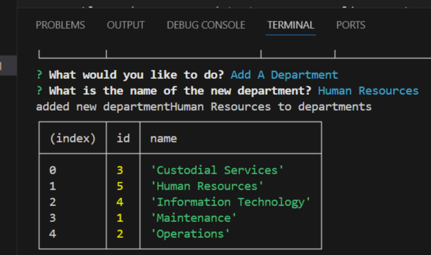
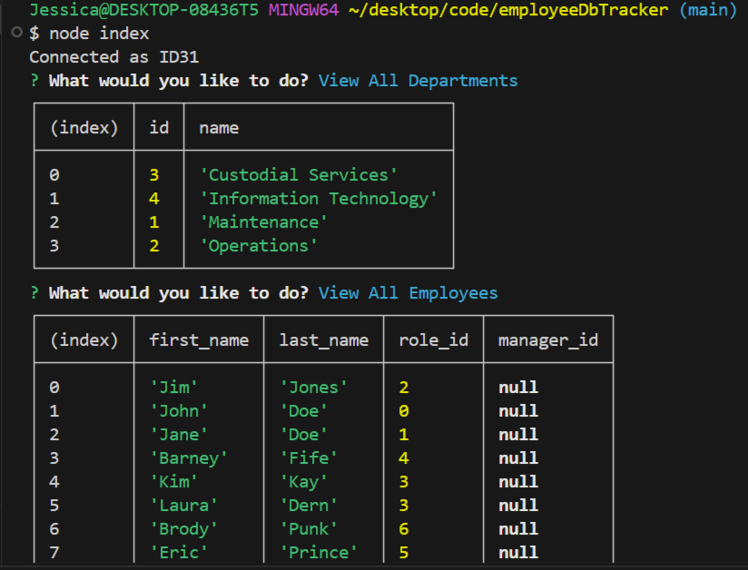
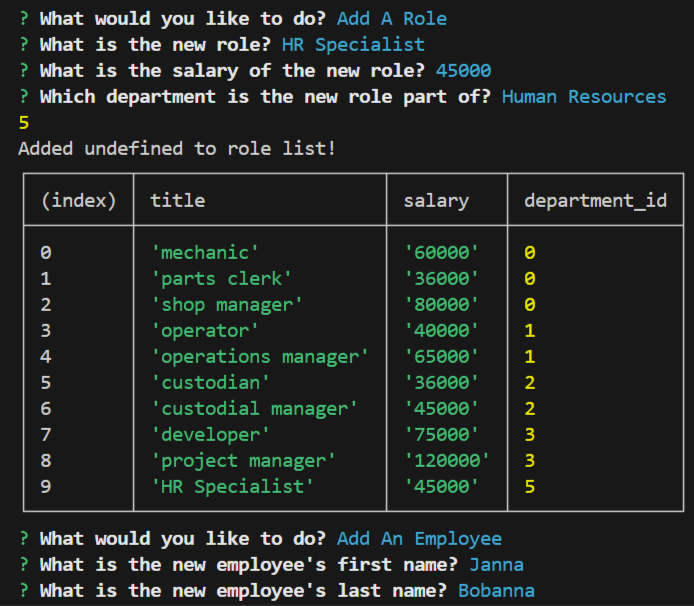

# SQL Employee Database

## Description

The challenge with this project was to create a content management system using SQL. This command line application manages a company's employee database using MySQL along with Node.js and Inquirer.

## Table of Contents

- [Installation](#installation)
- [Usage](#usage)
- [Credits](#credits)
- [License](#license)

## Installation

To run this project you will need to have:
- Git Bash (Windows)/Terminal (Mac)
- Node.js
- MySQL

Clone the repository to your local device and navigate to the directory that contains the repository using Git Bash/Terminal. 

Run `npm i` to install the required dependencies, including Inquirer. Then open the MySQL shell, log in, and run the command `source db/schema.sql;`, followed by `source db/seeds.sql` to start and seed the database. Exit the MySQL shell and run `node index` to start the server and begin the prompts.

## Usage

You can see a video of me using the application in the command line [here](https://drive.google.com/file/d/1WWKLNNPJLg9p_IinWFsel3fWeaemS0I5/view)

## Known Issues

- Update Employee Role prompt does not work
- Giving employees a manager causes seed to fail, so no employees have a manager

## Credits

This project features code heavily modified from a class activity for the SQL week of class.

## License

This project is licensed with the MIT license 2024 by Jessica Jones
---